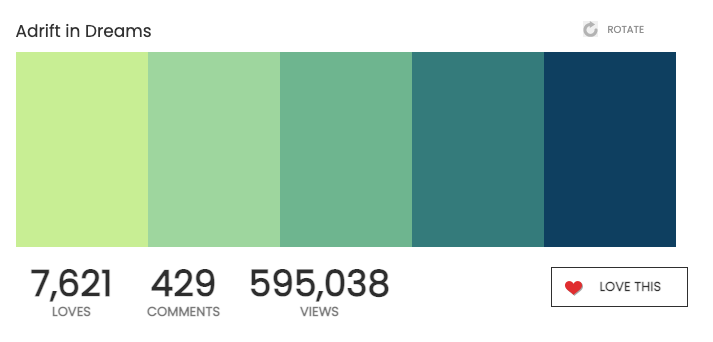
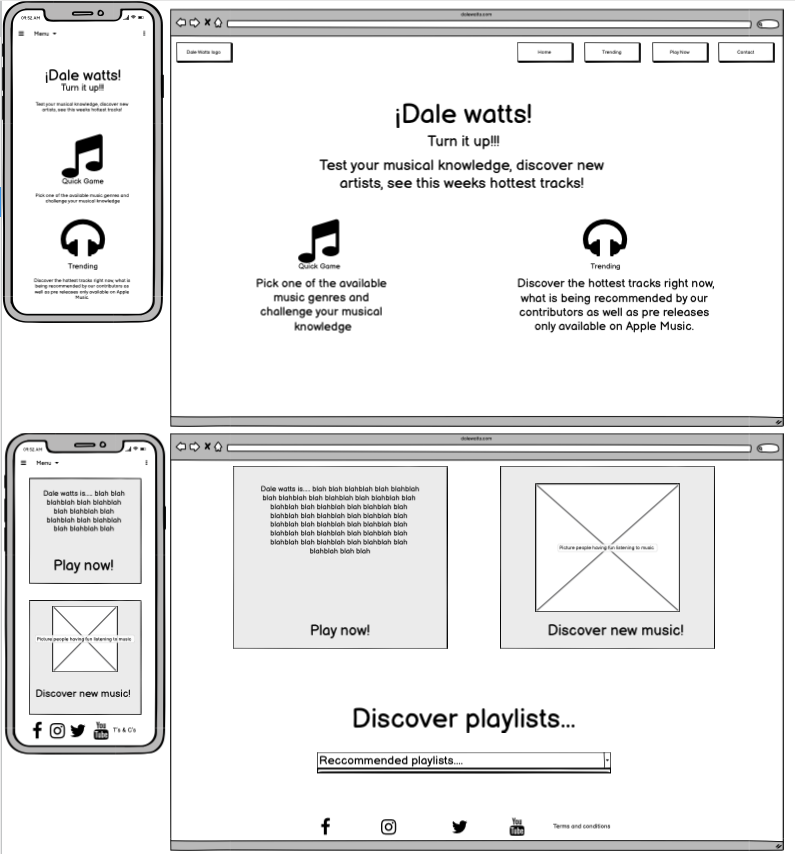
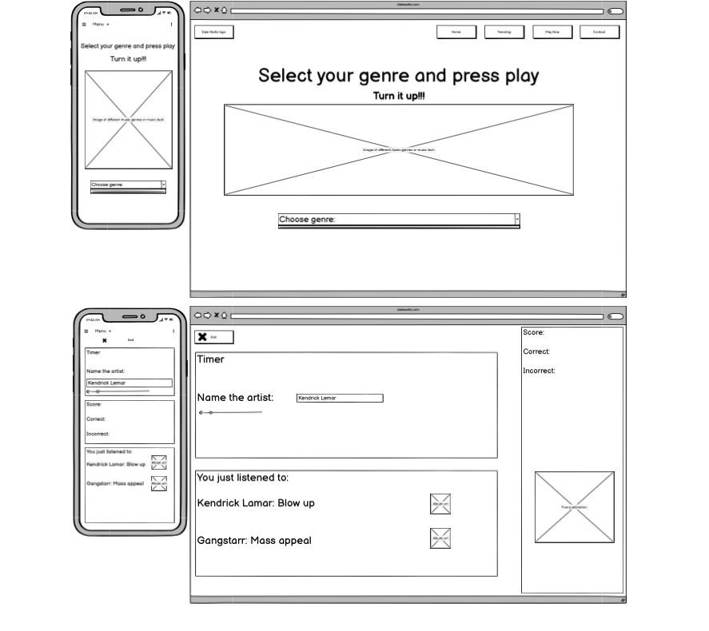
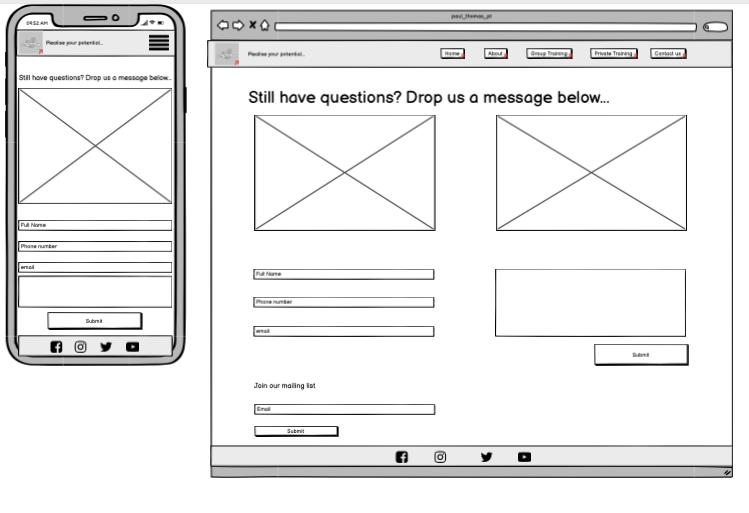

# Paul Thomas PT
(Developer: Paul Thomas O´Riordan)

[Live webpage](https://rashdogg74.github.io/paul_thomas_pt/)

## Table of Contents

1. [Project Goals](#project-goals)
    1. [User Goals](#user-goals)
    2. [Site Owner Goals](#site-owner-goals)
2. [User Experience](#user-experience)
    1. [Target Audience](#target-audience)
    2. [User Requrements and Expectations](#user-requrements-and-expectations)
    3. [User Stories](#user-stories)
3. [Design](#design)
    1. [Design Choices](#design-choices)
    2. [Colour](#colours)
    3. [Fonts](#fonts)
    4. [Structure](#structure)
    5. [Wireframes](#wireframes)
4. [Technologies Used](#technologies-used)
    1. [Languages](#languages)
    2. [Frameworks & Tools](#frameworks-&-tools)
5. [Features](#features)
6. [Testing](#validation)
    1. [HTML Validation](#HTML-validation)
    2. [CSS Validation](#CSS-validation)
    3. [Accessibility](#accessibility)
    4. [Performance](#performance)
    5. [Device testing](#performing-tests-on-various-devices)
    6. [Browser compatibility](#browser-compatability)
    7. [Testing user stories](#testing-user-stories)
8. [Bugs](#Bugs)
9. [Deployment](#deployment)
10. [Credits](#credits)
11. [Acknowledgements](#acknowledgements)

## Project Goals

### User Goals
- To play a music quiz game
- To discover new music
- To save high scores on the website
- To contact the website owner

### Site Owner Goals
- Offer a fun engaging experience for any user who has an interest in music
- Increase traffic to the website
- Draw attention to the brand
- Provide a fixed point for all navigation relating to the brand

## User Experience

### Target Audience
- Individuals interested in music and trivia
- Individuals with spare time on their hands

### User Requirements and Expectations

- A simple and intuitive navigation system.
- Quickly and easily find relevant information.
- Links that work as expected.
- A quiz which works correctly and records all high scores.
- Regularly updating music trends and playlists.
- Well presented and a visually appealing design regardless of device.
- An easy way to contact the business.
- Accessibility.

### User Stories

#### First-time User 
1. As a first time user, I want to know what services are offered by ¡Dale Watts!
2. As a first time user, I want to be able to navigate quickly to a short quiz to test my knowledge
3. As a first time user, I want to be able to see my high scores and compare them to others
4. As a first time user, I want to see the various social media channels

#### Returning User
5. As a returning user, I want to see my high scores and compare them to others
6. As a returning user, I want to see new questions constantly offered
7. As a returning user, I want to see new music reccommendations
8. As a returning user, I want to make contact with the website owner

#### Site Owner 
9. As the site owner, I want users to interact with my brand, get to know the services offered, and make contact through social media.
10. As the site owner, I want users to enjoy the browsing experience and the quiz. 

## Design

### Design Choices
The webpage was designed with my own personal style in mind. Cool, sleek, simple design and clear and to the point. Focus was put on the gradient color scheme which works well across all devices.

### Colour
For the colour scheme cool and vibrant colors were chosen to reflect the calmness and simplicity of my own character and the services the website offers, as well as being energetic, and inspiring movement through music. 
 

### Fonts
Comforter was used for the logo, The logic behind this was to make it look edgy and different (as it means "turn it up" in spanish). The rest of the website was styled using Oswald for a clean easy to ready look. 
 

### Structure
The page is structured in a well known, recognizable, user-friendly, and easy to learn manner. Upon arriving at the website the user sees a familiar type of navigation bar with the business' logo on the left side and the navigation links to the right. 
The website consists of six separate pages: 
- A homepage
- A quiz page
- A discover page
- A contact page 
- A highscores page
- An end page (after completing the quiz which a user can only navigate to by completing a quiz)

### Wireframes

Shown below are the initial wireframes which changed throughout the development process. Reasons include: increasing subject knowledge of UX design and CSS options, removal of bootstrap elements, the need for a cleaner more streamlined design. 

- Home

- Discover 

- Quiz 

- Contact 

## Technologies Used

### Languages
- HTML
- CSS
- Javascript

### Frameworks & Tools
- Git
- GitHub
- Gitpod
- Bootstrap
- Convertio
- Balsamiq
- Google Fonts
- Color Space
- Font Awesome
- Favicon

## Features
The page consists of six pages and the main features include 

### Logo and Navigation Bar

Screenshot nav bar

Screenshot nav bar mobile

- Featured on all five pages.
- The navbar is fully responsive and changes to a toggler (hamburger menu) on smaller screens and includes links to the 
- If a user hovers over a nav bar option in desktop mode an animation shows them which option they are choosing. 

### Footer

Screenshot

### Discover

Screenshot

- 

### Quiz 

Screenshot

- 

### High Scores

Screenshot

### Contact 

Screenshot

### User stories covered
- All of the above highlights user stories 1-13 being covered.

## Validation

### HTML Validation
The W3C Markup Validation Service was used to validate the HTML of the website. All pages passed with no errors nor warnings to show.

Home

Discover

Quiz

High Scores

Contact

### CSS Validation

Screenshot

The W3C Jigsaw CSS Validation Service was used to validate the CSS of the website.

### Accessibility
The WAVE WebAIM web accessibility evaluation tool was used to ensure the website met high accessibility standards. 

Home

Discover

Quiz

High Scores

Contact

### Performance 
Google Lighthouse in Google Chrome Developer Tools was used to test the performance of the website.

Home

Discover

Quiz

High Scores

Contact

### Performing tests on various devices 
The website was tested on the following devices:
- HP desktop
- Macbook
- iPad
- iPhone X
- Huawei mobile

In addition, the site was tested using Google Chrome Developer Tools Device Toggling option for all available device options.

### Browser compatibility
The website was tested on the following browsers:
- Google Chrome
- Mozilla Firefox
- Safari

### Testing user stories

1. As a first time user, .

| **Feature** | **Action** | **Expected Result** | **Actual Result** |
|-------------|------------|---------------------|-------------------|
| Home page | Navigate to the type of training you are most interested in | Locating group or private training information | Works as expected |
| Footer - social media links | On any page scroll down to the footer | Find the links to the social media accounts | Works as expected |

2. As a first time user, .

| **Feature** | **Action** | **Expected Result** | **Actual Result** |
|-------------|------------|---------------------|-------------------|
| Group / Private training pages | Navigate to the Menu  | See training options and descriptions | Works as expected |

3. As a first time user, . 

| **Feature** | **Action** | **Expected Result** | **Actual Result** |
|-------------|------------|---------------------|-------------------|
| Contact page | Navigate to the contact page and locate the form | Find and fill out contact form | Works as expected |
| Footer-social media links  | On any page scroll down to the footer | Contact via social media platform of your choice | Works as expected | 

4. As a first time user, .

| **Feature** | **Action** | **Expected Result** | **Actual Result** |
|-------------|------------|---------------------|-------------------|
| Gallery | Navigate to the home page or either training page | Find pictures of the classes | Works as expected |

5. As a returning user, .

| **Feature** | **Action** | **Expected Result** | **Actual Result** |
|-------------|------------|---------------------|-------------------|
| Group-training page | Navigate to the group training page and locate the class table | Find the class schedule | Works as expected |

6. As a returning user, .

| **Feature** | **Action** | **Expected Result** | **Actual Result** |
|-------------|------------|---------------------|-------------------|
| Contact page | Navigate to the contact page and locate the form | Find and fill out contact form | Works as expected |
| Footer-social media links  | On any page scroll down to the footer | Contact via social media platform of your choice | Works as expected | 

7. As a returning user, .

| **Feature** | **Action** | **Expected Result** | **Actual Result** |
|-------------|------------|---------------------|-------------------|
| Footer-social media links  | On any page scroll down to the footer | Contact via social media platform of your choice | Works as expected | 

8. As a returning user, .

| **Feature** | **Action** | **Expected Result** | **Actual Result** |
|-------------|------------|---------------------|-------------------|
| About page | Navigate to the contact page and locate the section on Paul Thomas | Read the page | Works as expected |

9. As a returning user, .

| **Feature** | **Action** | **Expected Result** | **Actual Result** |
|-------------|------------|---------------------|-------------------|
| Footer-social media links  | On any page scroll down to the footer | Contact via social media platform of your choice | Works as expected | 
| Contact page | Navigate to the contact page and locate the form | Find and fill out contact form | Works as expected |

10. As a returning user,.

| **Feature** | **Action** | **Expected Result** | **Actual Result** |
|-------------|------------|---------------------|-------------------|
| Map | On group training page, scroll to the bottom to find embedded map showing class locations | Click on map locations | Works as expected | 

11. As the site owner,.

| **Feature** | **Action** | **Expected Result** | **Actual Result** |
|-------------|------------|---------------------|-------------------|
| Footer-social media links  | On any page scroll down to the footer | Contact via social media platform of your choice | Works as expected | 
| Contact page | Navigate to the contact page and locate the form | Find and fill out contact form | Works as expected |
| About page | Navigate to the contact page and locate the section on Paul Thomas | Read the page | Works as expected |

12. As the site owner, .

| **Feature** | **Action** | **Expected Result** | **Actual Result** |
|-------------|------------|---------------------|-------------------|
| Group / Private training pages | Navigate to the Menu  | See training options and descriptions | Works as expected |
| Home page | Navigate to the type of training you are most interested in | Locating group or private training information | Works as expected |

13. As the site owner, .

| **Feature** | **Action** | **Expected Result** | **Actual Result** |
|-------------|------------|---------------------|-------------------|
| About page | Navigate to the contact page and locate the section on client testimonies at the bottom of the page | Read the section | Works as expected |

## Bugs

| **Bug** | **Fix** |
| ----------- | ----------- |

## Deployment
The website was deployed using GitHub Pages by following these steps:
1. In the GitHub repository navigate to the Settings tab.
2. Select Pages from the menu on the left hand-side.
3. For the source select Branch: master.
4. After the webpage refreshes automatically a ribbon on the top says: "Your site is published at "https://rashdogg74.github.io/"

You can fork the repository by following these steps:
1. Go to the GitHub repository.
2. Click on Fork button in upper right hand corner.

You can clone the repository by following these steps:
1. Go to the GitHub repository.
2. Locate the Code button above the list of files and click it.
3. Select if you prefer to clone using HTTPS, SSH, or Github CLI and click the copy button to copy the URL to your clipboard.
4. Open Git Bash.
5. Change the current working directory to the one where you want the cloned directory.
6. Type git clone and paste the URL from the clipboard ($ git clone https://github.com/YOUR-USERNAME/YOUR-REPOSITORY)
7.Press Enter to create your local clone.

## Credits
Images not referenced below are owned by the developer.

### Media
In order of appearance:
- Photo by <a href="https://www.flaticon.com/authors/freepik">Freepik</a> on <a href="https://www.flaticon.com/premium-icon/music-therapy_6197540">Flaticon</a>
- Photo by <a href="https://www.flaticon.com/authors/alkhalifi-design">alkhalifi design</a> on <a href="https://www.flaticon.com/premium-icon/trending-topic_3133923">Flaticon</a>
- Photo by <a href="https://www.flaticon.com/authors/smalllikeart">smalllikeart</a> on <a href="https://www.flaticon.com/free-icon/podium_1228297">Flaticon</a>
- Photo by <a href="https://www.flaticon.com/authors/andrean-prabowo">Andrean Prabowo</a> on <a href="https://www.flaticon.com/premium-icon/headphone_3756812">Flaticon</a>
  
### Code
In order of appearance:
- 
- 
- 
- 404 page was build using description on [GitHub Docs](https://docs.github.com/en/pages/getting-started-with-github-pages/creating-a-custom-404-page-for-your-github-pages-site) and (https://www.youtube.com/watch?v=kPtS4vO42II&ab_channel=DaniKrossing) Dani Krossing on youtube. 

## Acknowledgements
I would like to take the opportunity to thank:
- My mentor Mo Shami for his feedback, advice, guidance and support.
- To the lovely people on the Code Institute Slack for encouraging all the way.
- To the Code Institute tutors for helping me with a couple of critical issues.
- To my coworkers at Hastings school, Madrid for encouraging me and offering me help when needed with workload.